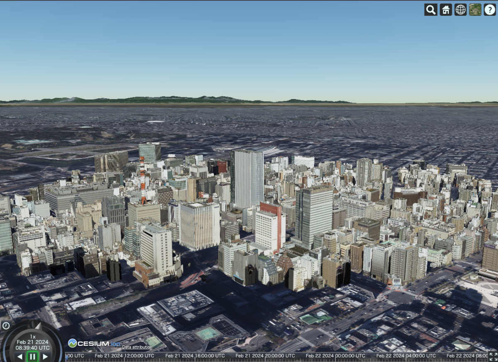

# PLATEAU GIS Converter

[](https://github.com/MIERUNE/nusamai/actions/workflows/test_libs.yml)
[](https://github.com/MIERUNE/nusamai/actions/workflows/test_app.yml)
[](https://codecov.io/gh/MIERUNE/plateau-gis-converter)
[](https://app.fossa.com/projects/git%2Bgithub.com%2FMIERUNE%2Fplateau-gis-converter?ref=badge_shield)

<!--
[](https://mierune.github.io/nusamai/app/)
-->

A proof of concept GUI and CLI tool for converting PLATEAU's 3D city models (CityGML) of Japan into various geospatial formats, including 3D Tiles, MVT, and GeoPackage.

## 1. 概要

本リポジトリでは、FY2023 の Project PLATEAU「都市デジタルツインの実現に向けた研究開発及び実証調査業務」（内閣府/研究開発とSociety5.0との橋渡しプログラム（BRIDGE））において開発された「PLATEAU GIS Converter」のソースコードを公開しています。

**PLATEAU GIS Converter** は、[PLATEAU](https://www.mlit.go.jp/plateau/)が提供するCityGML形式の3D都市モデルを他の一般的なGISデータ形式に変換するソフトウェアです。

[東京都23区の CityGML (v2)](https://www.geospatial.jp/ckan/dataset/plateau-tokyo23ku-2022/resource/55c72dd0-32eb-4107-9526-71fc0af8d50f3) を読み込んで、3D Tiles に変換した例：



ソフトウェアのメイン画面：


PLATEAU の標準仕様に準拠した CityGML 2.0 形式の3D都市モデルは、専門のGISツールやCLIコマンドを用いて他のGIS形式に変換して用いられることが一般的ですが、一般ユーザーが簡易に利用できる汎用ツールは存在しません。そのため、流通や活用の範囲が専門家や技術者に限られていました。

## 2. 「PLATEAU GIS Converter」について

「PLATEAU GIS Converter」を利用することで、3D都市モデルを一般的なGIS形式に変換して、様々な分析・開発を行うことができます：

- GeoPackage 形式による [QGIS](https://www.qgis.org/) 等での解析
- Mapbox Vector Tiles (MVT) 形式による、大規模データのWeb等での高速描画
- 3D Tiles 形式による [Cesium](https://cesium.com/) 等での可視化
- KML 形式による Google Earth での可視化
- など

## 3. 利用手順

- 安定版のソフトウェアは、GitHub リポジトリの[Releaseページ](https://github.com/MIERUNE/PLATEAU-GIS-Converter/releases)（PLATEAU リポジトリ）からダウンロードしてください。
  - 最新版はこちら（株式会社MIERUNE リポジトリ [Releaseページ](https://github.com/MIERUNE/PLATEAU-GIS-Converter/releases)）からダウンロード可能です。
- 詳しい利用方法については、こちらの[マニュアル](https://project-plateau.github.io/PLATEAU-GIS-Converter/)をご覧ください。

## 4. システム概要

本ソフトウェアの機能は以下の通りです：

- 3D都市モデル（CityGML）の以下の形式への変換：
  - 3D Tiles
  - Mapbox Vector Tiles (MVT)
  - GeoPackage
  - GeoJSON
  - Shapefile
  - KML
  - CZML
  - Minecraft
  - glTF
  - Wavefront OBJ
- 複数の入力ファイルをもとにした変換
- 属性名マッピングルールの取り込み
- 指定された座標参照系に変換して出力（一部形式で対応）

## 5. 利用技術

利用技術は以下の通りです。

内部ロジック：

- 都市モデルの解析および他形式への変換はすべてプログラミング言語 [Rust](https://www.rust-lang.org/) で実装しています。多くの処理はゼロから独自に実装したものです。

ユーザインタフェース (UI)：

- デスクトップアプリケーション構築フレームワーク: [Tauri](https://github.com/tauri-apps/tauri)
- Web UI構築フレームワーク: [Svelte](https://svelte.dev/)

## 6. 動作環境

本ソフトウェアは以下の環境で動作することを想定しています：

- OS:
  - Windows 10 以上 (Intel)
  - macOS (Apple Silicon, Intel)
- CPU:
  - 特に制限はありませんが、出力形式や変換するデータ量によっては、CPU性能が処理時間に大きく影響します。
- メモリ:
  - 特に制限はありませんが、出力形式や変換するデータ量によっては、変換時に多くのメモリを要します。
- ネットワーク:
  - インターネット接続は不要です。
- ストレージ:
  - インストールには30MB程度の空き容量が必要です。
  - データ変換時には、変換元データと同等ないしそれ以上の空き容量が必要です。

## 7. 本リポジトリのフォルダ構成

- アプリケーション：
  - [`app`](./app/) &mdash; Tauri による GUI 実装
  - [`nusamai`](./nusamai/) &mdash; アプリケーションバックエンドおよびコマンドライン版の実装
- データソース：
  - [`nusamai-citygml`](./nusamai-plateau/citygml/) &mdash; CityGML パーサ実装支援ライブラリ
    - [`macros`](./nusamai-plateau/citygml/macros/) &mdash; パーサ導出用の proc macros
  - [`nusamai-plateau`](./nusamai-plateau/) &mdash; PLATEAU 用の CityGML モデルおよびパーサ
- 基盤・ユーティリティ（本プロジェクトのユースケースと癒着しないように構成）：
  - [`nusamai-projection`](./nusamai-projection/) &mdash; 投影法変換
  - [`nusamai-gpkg`](./nusamai-gpkg/) &mdash; GeoPackage
  - [`nusamai-gltf`](./nusamai-gltf/) &mdash; glTF
  - [`nusamai-geojson`](./nusamai-geojson/) &mdash; GeoJSON
  - [`nusamai-kml`](./nusamai-kml/) &mdash; KML
  - [`nusamai-czml`](./nusamai-czml/) &mdash; CZML
  - [`nusamai-shapefile`](./nusamai-shapefile/) &mdash; Shapefile

### 7.1. 外部リポジトリ

- [MIERUNE/earcut-rs](https://github.com/MIERUNE/earcut-rs) &mdash; ポリゴン三角形化アルゴリズムのRust移植
- [MIERUNE/japan-geoid](https://github.com/MIERUNE/japan-geoid) &mdash; 日本のジオイドモデル (JGD2011 → WGS 84 の変換)
- [MIERUNE/flatgeom-rs](https://github.com/MIERUNE/flatgeom-rs) &mdash; シリアライズ/デシリアライズの効率を優先したジオメトリ型
- [MIERUNE/kv-extsort-rs](https://github.com/MIERUNE/kv-extsort-rs) &mdash; Key-value データの外部ソート
- [MIERUNE/dda-vozelize-rs](https://github.com/MIERUNE/dda-voxelize-rs) &mdash; 3Dメッシュサーフェスの高速なボクセル化
- [MIERUNE/cesiumtiles-rs](https://github.com/MIERUNE/cesiumtiles-rs) &mdash; 3D TilesのJSONモデルなど
- [MIERUNE/atlas-packer](https://github.com/MIERUNE/atlas-packer) &mdash; テクスチャアトラスの作成
- [MIERUNE/tinymvt](https://github.com/MIERUNE/tinymvt) &mdash; MVT生成のためのユーティリティ

## 8. ライセンス

- 本ソフトウェアは、MITライセンスのもとで提供されるオープンソースソフトウエアです。
- ソースコードおよび関連ドキュメントの著作権は国土交通省および開発者に帰属します。
- 本ソフトウェアの開発は[株式会社MIERUNE](https://www.mierune.co.jp/)が行っています。

## 9. 注意事項

- 本リポジトリおよびソフトウェアは Project PLATEAU の参考資料として提供しているものです。動作の保証は行っておりません。
- 本リポジトリおよび本ソフトウェアの利用により生じた損失及び損害等について、開発者および国土交通省はいかなる責任も負わないものとします。
- 本リポジトリの内容は予告なく変更・削除する場合があります。

## 10. 参考資料

- [PLATEAU プロジェクト](https://www.mlit.go.jp/plateau/)
- [3D都市モデル標準製品仕様書](https://www.mlit.go.jp/plateaudocument/)
- [PLATEAU QGIS Plugin](https://github.com/MIERUNE/plateau-qgis-plugin)

## Development (開発者向け情報)

<!--
- [MIERUNE/plateau-schema-experiment](https://github.com/MIERUNE/plateau-schema-experiment) — CityGML 2.0 と i-UR の XML Schema を解析する実験コード群。QGIS Pluginの属性列挙に使用。
- [MIERUNE/3dtiles-research](https://github.com/MIERUNE/3dtiles-research) — 3D Tiles / glTF の実験コード群
-->

### Build &amp; Run

#### CLI

```bash
cd ./nusamai/
# Debug (非常に低速)
cargo run -- ~/path/to/PLATEAU/15100_niigata-shi_2022_citygml_1_op/udx/bldg/*.gml --sink geojson --output foobar.geojson
# Release (最適化コンパイル)
cargo run --release -- ~/path/to/PLATEAU/15100_niigata-shi_2022_citygml_1_op/udx/bldg/*.gml --sink geojson --output foobar.geojson
# Release (LTO有効のプロダクションビルド、最高速)
cargo run --profile release-lto -- ~/path/to/PLATEAU/15100_niigata-shi_2022_citygml_1_op/udx/bldg/*.gml --sink geojson --output foobar.geojson
```

#### GUI

Dev:

```bash
cd ./app/
npm install
RUST_BACKTRACE=1 npx tauri dev
```

Build:

```bash
cd ./app
npx tauri build
```

### Test

- Test & Lint

```bash
cargo clippy --all-targets --all-features
cargo test --workspace --exclude app --all-features
```

#### Coverage

Codecov: [https://app.codecov.io/gh/MIERUNE/plateau-gis-converter](https://app.codecov.io/gh/MIERUNE/plateau-gis-converter)

```bash
cargo llvm-cov --workspace --exclude app --html --all-features
```

### Authors（主要開発者）

- Taku Fukada ([@ciscorn](https://github.com/ciscorn))
- Satoru Nishio ([@nokonoko1203](https://github.com/nokonoko1203))
- Qu Xinmiao ([@xinmiaooo](https://github.com/xinmiaooo))
- Sorami Hisamoto ([@sorami](https://github.com/sorami))
- Teruki Tada ([@TadaTeruki](https://github.com/TadaTeruki))
- Satoshi Komatsu ([@satoshi7190](https://github.com/satoshi7190))
- And [every contributors](https://github.com/MIERUNE/plateau-gis-converter/graphs/contributors)
