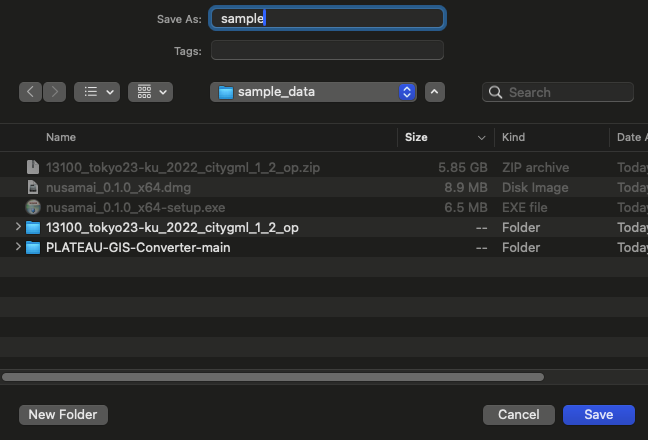
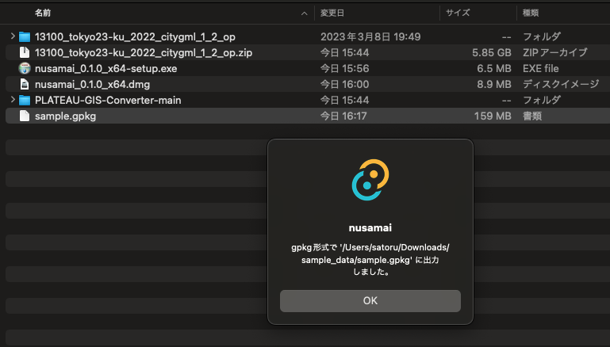
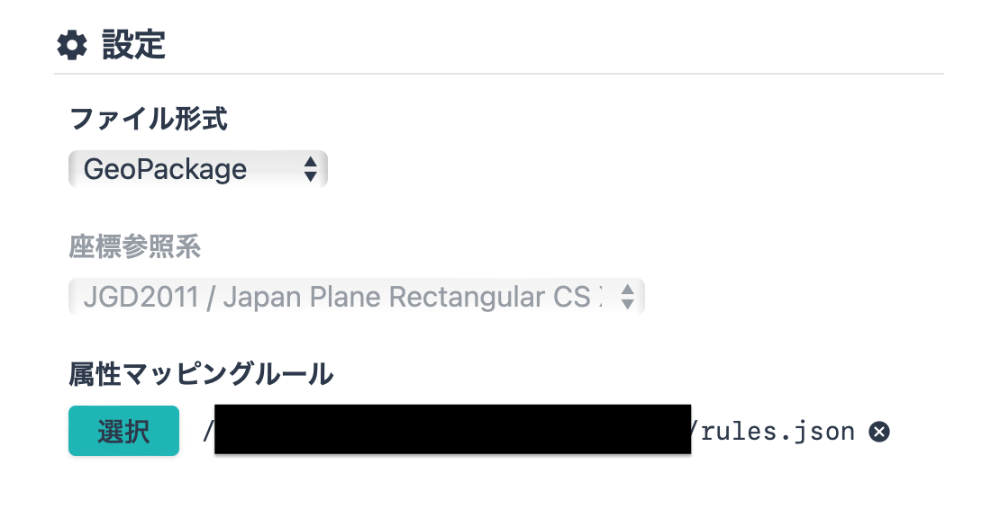
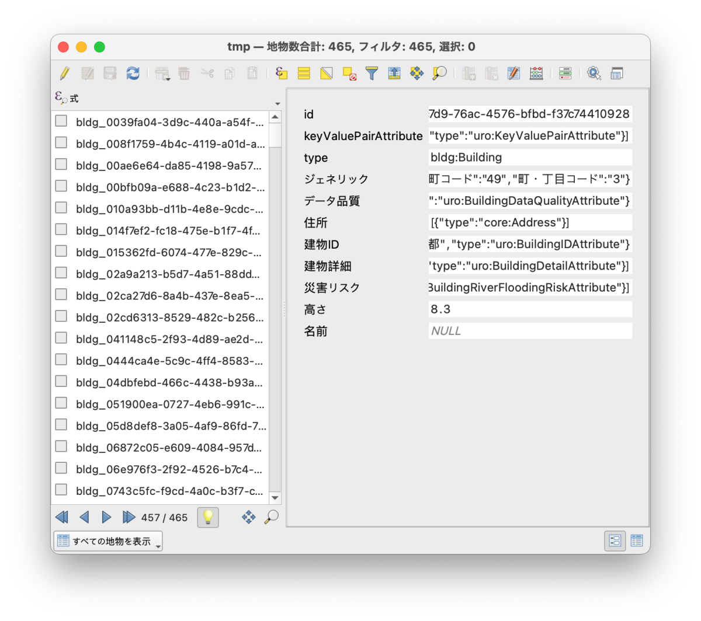
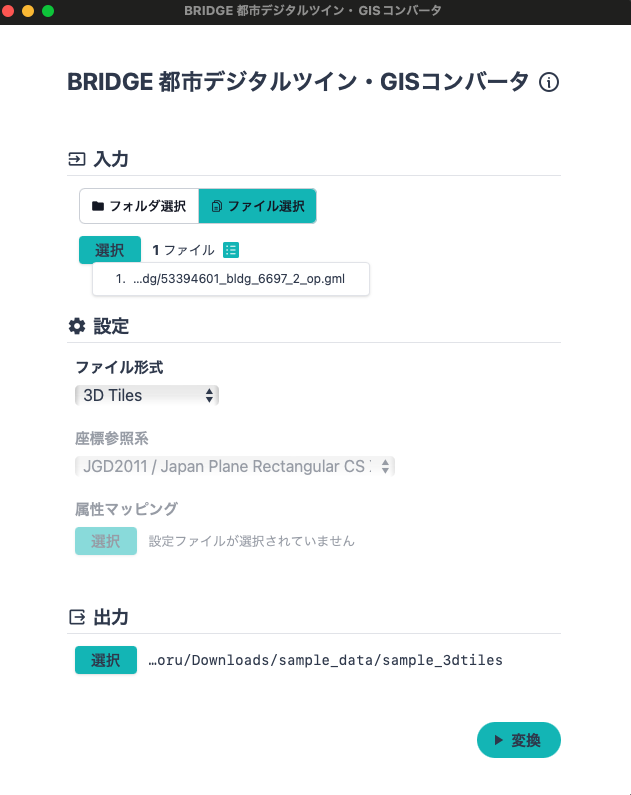

# GUIで利用する

## MacOSで利用する

Windowsで利用する場合も、同様のUI・手順で利用することができます。
以下、MacOSでの利用方法を記載します。
本ツールは設定項目が少なく、シンプルに利用することができるため、いくつかの主要なファイル形式に絞って説明をします。

### GeoPackageファイルに変換する

- [GeoPackage](https://www.geopackage.org/)はSQLiteベースのファイル形式で、ベクトルデータを格納することができます。
  - バイナリ形式でデータを格納するため、GeoJSONなどのテキスト形式のデータよりファイルサイズが小さく、高速にデータを読み込むことができます。
  - ほぼ全てのGISで利用可能なため、Shapefileの代替として広く利用されています。


- `ファイル選択`ボタンをクリックします。


- `選択`ボタンをクリックし、変換したいファイルを選択します。
  - ダウンロード・解凍したデータから`~/sample_data/13100_tokyo23-ku_2022_citygml_1_2_op/udx/bldg`以下の.gmlファイルを選択します。
  - 複数ファイル選択することも可能です。


- `ファイル形式`を`GeoPackage`に選択します。


- 座標参照系を変換したい座標系に変えます。
  - 座標参照系は、GeoPackageおよびShapefile選択時にのみ変更することができます。

※todo: 機能開発中です

- 出力先を指定します。
  - 拡張子は自動で付与されるので、ファイル名のみを指定してください。



- `変換`ボタンをクリックし、データをGeoPackageに変換します。


- データが変換されるとダイアログが表示されます。



- [QGIS](https://www.qgis.org/ja/site/index.html)などのGISを利用して解析することができます。


- QGISの利用方法については[こちら](https://www.mlit.go.jp/plateau/learning/tpc05-1/)を参照してください。

#### 属性名を変換する

- 属性名などに日本語名などを利用したい場合は、`rules.json`を利用して属性名を変換することができます。
- 以下のような、属性名変換用の`rules.json`を作成します。
  - `rename`に変換前の属性名と変換後の属性名を記述します。
  - 例えば、`buildingIDAttribute`を`建物ID`に変換したい場合は、以下のように記述します。

```json
{
    "rename": {
        "buildingIDAttribute": "建物ID",
        "address": "住所",
        "buildingDataQualityAttribute": "データ品質",
        "buildingDetailAttribute": "建物詳細",
        "genericAttribute": "ジェネリック",
        "measuredHeight": "高さ",
        "buildingDisasterRiskAttribute": "災害リスク",
        "name": "名前"
    }
}
```

- `設定`の`属性マッピングルール`に`rules.json`を指定します。



- `変換`ボタンをクリックし、データを変換すると、属性名が変換されたGeoPackageが出力されます。



- 設定を行わない場合のデフォルトの属性名は

### Mapbox Vector Tilesに変換する

- [Mapbox Vector Tiles](https://docs.mapbox.com/data/tilesets/guides/)(以下、MVT)は、タイル形式に分割されたベクトルデータをWeb上で利用するためのファイル形式です。
  - ベクトルデータをタイル形式で格納するため、高速にデータを読み込むことができます。
  - 主に、WebGISで利用することができますが、QGISでも利用することが可能です。
  - データの色やラベルなどを柔軟に設定することができ、美しい地図を作成することができます。


- GeoPackageと同様に設定を変更していきます。
  - MVTでは、座標参照系を変換することができません。仕様上、EPSG:3857の座標系に変換されます。
  - MVTは大規模データの取り扱いに長けているため、ここでは`bldg`フォルダを選択し、全ての.gmlファイルを選択します。
    - ※大量のメモリ・CPUリソースを消費します。マシンによっては実行できませんので、ご注意ください。
  - 出力データ形式は`Vector Tiles`を選択します。
  - MVTは大量のファイルが出力されるため、出力先にはフォルダ名のみ指定します。


- 出力が終わると、以下のようなファイル群が作成されます。


- MVTはWebGISでの利用を想定しているため、QGISで利用するためには、ローカルサーバーを立ち上げる必要があります。
  - 生成されたファイル群をどこかへホスティングしても良いです。
- ターミナルなどを利用し、生成された`sample`（など、指定したフォルダ名）フォルダの中に移動します。
  - `cd ~/Downloads/sample_data/sample`など
- Pythonの`http.server`を利用してローカルサーバーを立ち上げます。

```bash
% python -m http.server
Serving HTTP on :: port 8000 (http://[::]:8000/) ...
```

- ブラウザで`http://localhost:8000`にアクセスすると、以下のように生成されたファイル一覧が表示されていれば成功です。


- QGISのブラウザパネルから`Vector Tiles`->`新規一般接続`を選択し、`http://localhost:8000/{z}/{x}/{y}.pbf`を追加します。
  - 名称は任意です。


- レイヤーに追加されると、以下のように表示されます。


### 3DTilesに変換する

- [3DTiles](https://www.cesium.com/3d-tiles/)は、点群データや建築物などの大規模3Dデータをタイル形式に分割し、Web上で利用するためのファイル形式です。
  - 3Dモデルデータ（glTF）をタイル形式で格納するため、高速にデータを読み込むことができます。


- その他ファイル形式と同様に、設定を行います。
  - 3DTilesでは、座標参照系を変換することができません。仕様上、EPSG:4978の座標系に変換されます。
  - 3DTilesは大量のファイルが出力されるため、出力先にはフォルダ名のみ指定します。
  - ※3DTilesでは、MVTよりもさらに大量のメモリ・CPUリソースを消費します。マシンによっては実行できませんので、ご注意ください。
    - 尚且つ、出力されるファイル群は非常に大きいため、東京23区全域などを変換する場合、ファイル数・総容量に注意してください。

- 例として、テクスチャ付きLOD2データの存在する`~/sample_data/13100_tokyo23-ku_2022_citygml_1_2_op/udx/bldg/53394601_bldg_6697_2_op.gml`を選択します。
  - テクスチャは自動的に取り込まれるため、テクスチャファイルは選択する必要はありません。



- MVTと同様、出力された`sample_3dtiles`（など、指定したフォルダ名）フォルダに移動し、Pythonの`http.server`を利用してローカルサーバーを立ち上げます。

```bash
% cd ~/sample_data/sample_3dtiles
% python -m http.server
Serving HTTP on :: port 8000 (http://[::]:8000/) ...
```

- `sample_3dtiles`フォルダ内に以下のような`index.html`を追加します。
  - Cesiumの詳しい利用方法については[こちら](https://www.mlit.go.jp/plateau/learning/tpc06-1/)を参照してください。

```html
<!DOCTYPE html>
<html>
 <head>
  <meta charset="UTF-8" />
  <title>Cesium</title>
  <script src="https://cesium.com/downloads/cesiumjs/releases/1.114/Build/Cesium/Cesium.js"></script>
  <link
   href="https://cesium.com/downloads/cesiumjs/releases/1.114/Build/Cesium/Widgets/widgets.css"
   rel="stylesheet"
  />
  <style>
   #cesiumContainer {
    position: absolute;
    top: 0;
    left: 0;
    height: 100%;
    width: 100%;
    margin: 0;
    overflow: hidden;
    padding: 0;
    font-family: sans-serif;
   }
   html {
    height: 100%;
   }
   body {
    padding: 0;
    margin: 0;
    overflow: hidden;
    height: 100%;
   }
  </style>
 </head>
 <body>
  <div id="cesiumContainer"></div>
  <script>
   // Set your token
   Cesium.Ion.defaultAccessToken =
    "<Your Token>";

   async function setup() {
    const viewer = new Cesium.Viewer("cesiumContainer", {
     terrainProvider: await Cesium.CesiumTerrainProvider.fromIonAssetId(
      770371,
      { requestVertexNormals: true }
     ),
     shadows: true,
    });

    var imageProvider = new Cesium.UrlTemplateImageryProvider({
     url: "https://gic-plateau.s3.ap-northeast-1.amazonaws.com/2020/ortho/tiles/{z}/{x}/{y}.png",
     maximumLevel: 19,
    });
    var currentImage =
     viewer.scene.imageryLayers.addImageryProvider(imageProvider);

    viewer.scene.screenSpaceCameraController.enableCollisionDetection = false;
    viewer.scene.globe.depthTestAgainstTerrain = true;

    // Set your 3DTiles
    const tileset = await Cesium.Cesium3DTileset.fromUrl("tileset.json");
    viewer.scene.primitives.add(tileset);
    viewer.zoomTo(tileset);
   }

   setup();
  </script>
 </body>
</html>
```

- `localhost:8000`にアクセスすると、以下のように3DTilesが表示されます。


