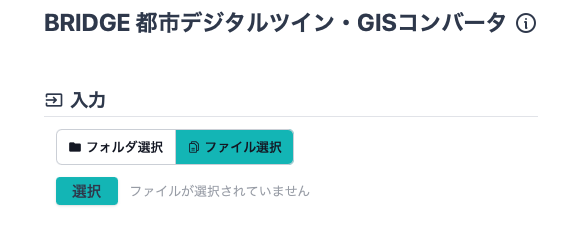
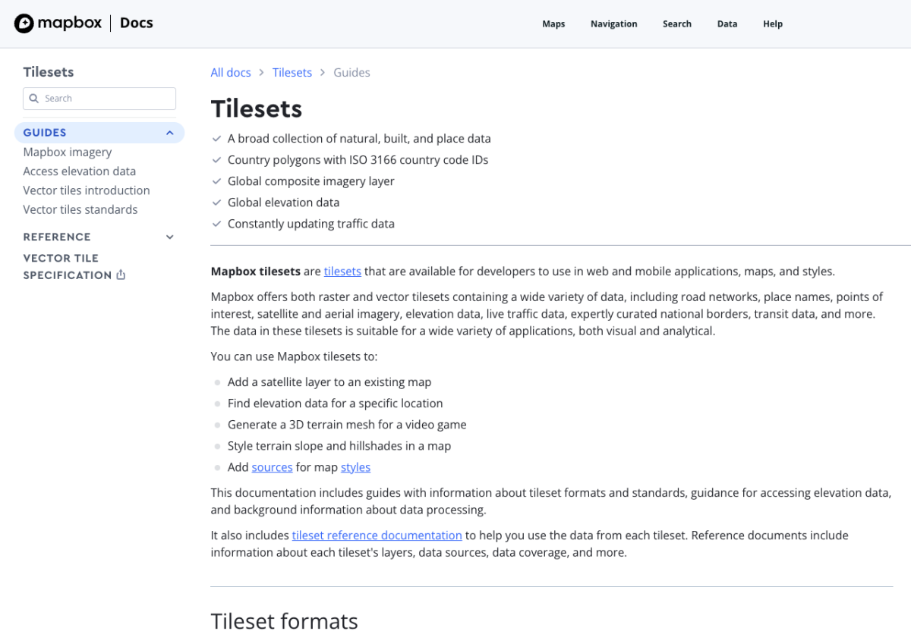
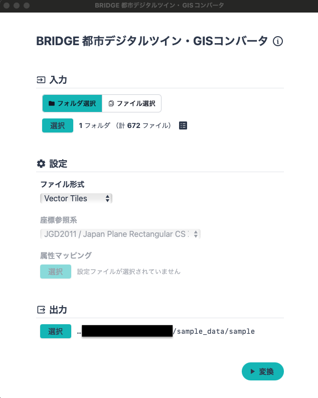
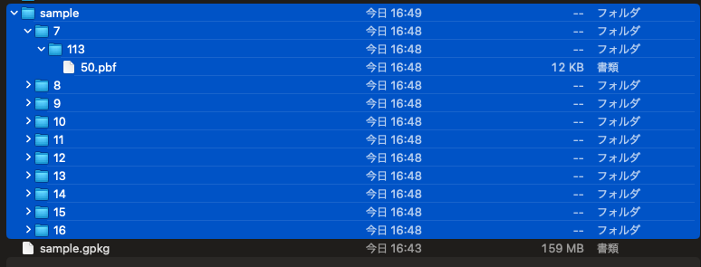

# GUIで利用する

## MacOSで利用する

Windowsで利用する場合も、同様のUI・手順で利用することができます。
以下、MacOSでの利用方法を記載します。
本ツールは設定項目が少なく、シンプルに利用することができるため、いくつかの主要なファイル形式に絞って説明をします。

### GeoPackageファイルに変換する

- [GeoPackage](https://www.geopackage.org/)はSQLiteベースのファイル形式で、ベクトルデータを格納することができます。
  - バイナリ形式でデータを格納するため、GeoJSONなどのテキスト形式のデータよりファイルサイズが小さく、高速にデータを読み込むことができます。
  - ほぼ全てのGISで利用可能なため、Shapefileの代替として広く利用されています。


- `ファイル選択`ボタンをクリックします。



- `選択`ボタンをクリックし、変換したいファイルを選択します。
  - ダウンロード・解凍したデータから`~/sample_data/13100_tokyo23-ku_2022_citygml_1_2_op/udx/bldg`以下の.gmlファイルを選択します。
  - 複数ファイル選択することも可能です。


- `ファイル形式`を`GeoPackage`に選択します。


- 座標参照系を変換したい座標系に変える

※todo: 機能開発中です

- 属性マッピング用の`mapping.json`を選択します。

※todo: 機能開発中です

- 出力先を指定します。
  - 拡張子は自動で付与されるので、ファイル名のみを指定してください。


- `変換`ボタンをクリックし、データをGeoPackageに変換します。


- データが変換されるとダイアログが表示されます。


- [QGIS](https://www.qgis.org/ja/site/index.html)などのGISを利用して解析することができます。


- QGISの利用方法については[こちら](https://www.mlit.go.jp/plateau/learning/tpc05-1/)を参照してください。

### Mapbox Vector Tilesに変換する

- [Mapbox Vector Tiles](https://docs.mapbox.com/data/tilesets/guides/)(以下、MVT)は、タイル形式に分割されたベクトルデータをWeb上で利用するためのファイル形式です。
  - ベクトルデータをタイル形式で格納するため、高速にデータを読み込むことができます。
  - 主に、WebGISで利用することができますが、QGISでも利用することが可能です。
  - データの色やラベルなどを柔軟に設定することができ、美しい地図を作成することができます。



- GeoPackageと同様に設定を変更していきます。
  - MVTでは、座標参照系を変換することができません。仕様上、EPSG:3857の座標系に変換されます。
  - MVTは大規模データの取り扱いに長けているため、ここでは`bldg`フォルダを選択し、全ての.gmlファイルを選択します。
    - ※大量のメモリ・CPUリソースを消費します。マシンによっては実行できませんので、ご注意ください。
  - 出力データ形式は`Vector Tiles`を選択します。
  - MVTは大量のファイルが出力されるため、出力先にはフォルダ名のみ指定します。



- 出力が終わると、以下のようなファイル群が作成されます。



- MVTはWebGISでの利用を想定しているため、QGISで利用するためには、ローカルサーバーを立ち上げる必要があります。
  - 生成されたファイル群をどこかへホスティングしても良いです。
- ターミナルなどを利用し、生成された`sample`フォルダの中に移動します。
  - `cd ~/Downloads/sample_data/sample`など
- Pythonの`http.server`を利用してローカルサーバーを立ち上げます。

```bash
% python -m http.server
Serving HTTP on :: port 8000 (http://[::]:8000/) ...
```

- ブラウザで`http://localhost:8000`にアクセスすると、以下のように生成されたファイル一覧が表示されていれば成功です。


- QGISのブラウザパネルから`Vector Tiles`->`新規一般接続`を選択し、`http://localhost:8000/{z}/{x}/{y}.pbf`を追加します。
  - 名称は任意です。


- レイヤーに追加されると、以下のように表示されます。


### 3DTilesに変換する
